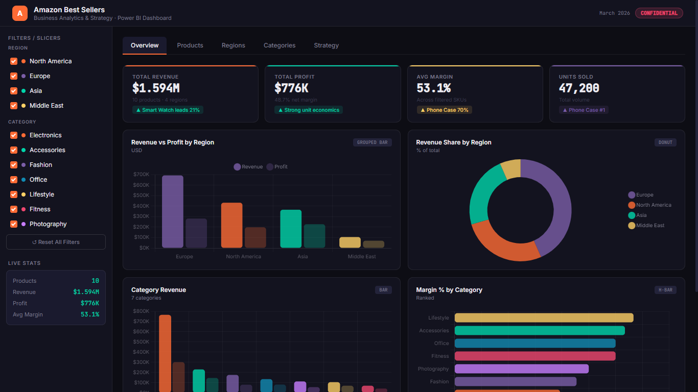

# 📊 Amazon Sales Analytics Dashboard

An interactive dashboard with business insights and strategy.

## 🚀 Features
- Interactive filters (Region, Product, Category)
- KPI tracking (Revenue, Profit, Margin, Units)
- Data visualization (Bar, Donut, Bubble charts)
- Clean and user-friendly UI

## 🧠 Key Insights
- Europe dominates revenue (43%)
- Phone Case has highest margin (70%)
- Electronics: high revenue but low margin
- Middle East: high potential market

📄 Report Included

Full business report with strategy and recommendations.

##📸 Dashboard Preview

## 🛠️ Tools & Technologies
- **Frontend:** HTML5, CSS3, JavaScript
- **Data Visualization:** Interactive Charts (Bar, Donut, Bubble)
- **Environment:** Browser-based dashboard

## ▶️ How to Use
1. Download or clone the repository
2. Open `Amazon-Sales-Analytics-Dashboard.html` in your browser

## 📂 Project Structure
- Amazon-Sales-Analytics-Dashboard.html
- amazon_report.pdf
- README.md

📬 Contact

●Available for freelance dashboard projects.
Amazon Sales Analytics Dashboard (with insights & strategy)

📬 Contact

rawadtahmid@gmail.com
